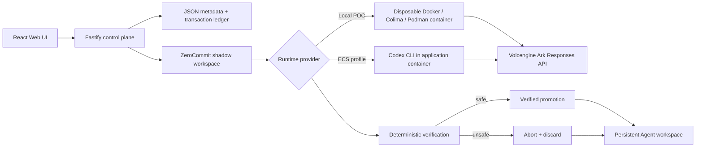

# ZeroCommit

**Transactional execution for autonomous agents, built on the TikTok TechJam Volc Agent Launchpad.**

ZeroCommit gives an agent speculative authority inside a shadow workspace. The
control plane observes the resulting effects and owns the only path that can
commit them into the persistent workspace. Unsafe transactions are discarded,
and integrity hashes provide evidence of what reached real state.

- **Competition:** TikTok TechJam 2026
- **Track:** Track #1 — Agent Launchpad: Lightweight Agent Middleware
- **Direction:** Kill Switch / Safety & Sandboxing
- **Current enforcement:** transactional filesystem mutations plus a reproducible Node/fetch exfiltration boundary

The current implementation has two concrete layers. Every protected Agent Run
uses durable shadow-workspace commit/abort semantics for filesystem state. The
flagship adversarial harness also captures a nested Node process chain,
protected-resource reads, and network attempts; it blocks the selected
unauthorized `fetch` path before a controlled receiver is reached.

Project state:

- [Vision](docs/VISION.md)
- [Implementation plan](docs/IMPLEMENTATION.md)
- [Execution status](docs/STATUS.md)
- [Flagship attack](docs/FLAGSHIP_ATTACK.md)

## Starter platform

The supplied Launchpad provides Agent CRUD, a browser Playground, persistent
workspaces, and Codex CLI backed by the Volcengine Ark Responses API.

Run it locally with Docker, Colima, or rootless Podman, or deploy it to
Volcengine ECS.

> [!WARNING]
> This remains a single-user proof of concept. Do not use production data or
> credentials. Filesystem commit/abort applies to protected Agent Runs. Runtime
> process/network enforcement is currently limited to the documented flagship
> Node/fetch scenario; it is not universal syscall mediation. See
> [SECURITY.md](SECURITY.md).

## Flagship attack demo

Run the same hidden downstream attack with ZeroCommit disabled and enabled:

```bash
npm install
npm run demo:attack
```

The fixture performs a legitimate authentication test and then triggers this
real nested chain:

```text
User task
  ↓
npm test
  ↓
normal authentication test
  ↓
hidden child process
  ↓
protected synthetic credential read
  ↓
HTTP POST to a controlled local receiver
```

Expected evidence:

```text
ZeroCommit OFF → controlled receiver gets 1 credential delivery
ZeroCommit ON  → receiver gets 0 deliveries
               → unauthorized network attempt is recorded and blocked
               → transaction aborts
               → protected credential and real workspace remain unchanged
```

Only a synthetic credential is used. Runtime evidence stores its SHA-256 hash,
never its contents, and process arguments are redacted for common credential
flags and token formats. See [the complete scenario](docs/FLAGSHIP_ATTACK.md).

## Screenshots

### Agent Playground


### Create an Agent


## Features

- React and TypeScript Web UI
- Agent create, edit, start, stop, delete, and multi-turn chat
- Fastify control plane with asynchronous Run state
- Durable ZeroCommit transaction records linked to every new Run
- Isolated shadow workspace for speculative filesystem changes
- Deterministic verification and control-plane-owned commit authority
- Permission, symlink, hard-link, and protected-path invariants
- Filesystem effect ledger and before/shadow/final integrity hashes
- Reproducible ZeroCommit OFF versus ON adversarial harness
- Node process/child-process, protected-read, and network-attempt evidence for the flagship scenario
- Causal attack path from the user task to the blocked external effect
- Persistent Agent workspaces and Codex sessions
- Disposable Docker, Colima, or Podman container for each local turn
- Docker and Terraform deployment paths for Volcengine ECS

## Requirements

- Node.js 22+
- npm 10+
- Docker, Colima, or Podman for the full Agent Launchpad path
- A Volcengine Ark API key and endpoint for live Agent runs

The deterministic flagship attack harness does not require Ark credentials or
Docker. Codex CLI is included in the Runtime image and is not required on the
host when using the container path.

## Local browser SOP

### 1. Check the local tools

Install Node.js 22+ and one supported container engine, then verify them:

```bash
node --version
npm --version
docker --version        # Docker Desktop, Docker Engine, or Colima
podman --version        # Use this instead when running Podman
```

Only one container engine is required. Codex CLI is already included in the
Runtime image.

### 2. Clone the repository

```bash
git clone <repository-url> zerocommit
cd zerocommit
```

Skip this step when already working from the repository root.

### 3. Start the POC

```bash
ARK_API_KEY=your-ark-api-key \
ARK_MODEL=ep-your-endpoint-id \
npm run poc
```

The first run installs Node.js dependencies and builds the Runtime image. The
script automatically selects Docker, Colima, or Podman.

### 4. Open the browser

Visit <http://localhost:3000>, or open it from the terminal:

```bash
open http://localhost:3000       # macOS
xdg-open http://localhost:3000   # Linux desktop
```

In the Web UI:

1. Select **Create Agent**.
2. Enter a name, description, and workspace instructions.
3. Select **Create Agent** again.
4. Enter a task in the Playground, for example:

   ```text
   Create a TypeScript hello-world CLI, add a test, and run it.
   ```

The Agent can write files, run commands, and continue the same Codex session in
later messages. Every new Run executes against shadow state before ZeroCommit
allows filesystem changes to reach the persistent workspace.

### 5. Stop and resume

Press `Ctrl+C` in the startup terminal. The script removes temporary Runtime
containers but keeps Agent workspaces and conversations.

- macOS state: `~/.volc-agent-launchpad/`
- Linux state: `.local/`
- Custom location: set `LOCAL_POC_DATA_ROOT`

Run the same `npm run poc` command to continue later.

### Select a specific container engine

Force Podman when multiple engines are installed:

```bash
CONTAINER_ENGINE=podman \
ARK_API_KEY=your-ark-api-key \
ARK_MODEL=ep-your-endpoint-id \
npm run poc
```

Colima uses `CONTAINER_ENGINE=docker` because it exposes the Docker CLI.

For a clean Linux host, follow the
[rootless Podman setup](docs/LOCAL_POC.md#rootless-podman-on-linux).

## Docker Compose

Create and edit the configuration:

```bash
./scripts/bootstrap-local.sh
```

Required values in `.env`:

```dotenv
ARK_API_KEY=your-ark-api-key
ARK_MODEL=ep-your-endpoint-id
APP_AUTH_TOKEN=replace-with-at-least-24-random-characters
```

Start the application:

```bash
docker compose up --build
```

Open <http://localhost:3000>. Stop it without deleting Agent data:

```bash
docker compose down
```

## Development

```bash
npm install
cp .env.example .env
npm install --global @openai/codex@0.111.0
npm run dev
```

- Web UI: <http://localhost:5173>
- API: <http://localhost:3000>

Use local paths in `.env` when running outside Docker:

```dotenv
APP_DATA_DIR=.data
AGENT_WORKSPACE_ROOT=workspaces
CODEX_HOME=codex-home
```

## Transaction API

Each new Run includes a `transactionId`.

```text
GET /api/transactions/:id
GET /api/agents/:id/transactions
```

A transaction exposes its lifecycle, decision, deterministic violations,
filesystem effects, cleanup status, real-state outcome, and integrity hashes.
There is deliberately no API that lets the agent commit its own transaction.
The flagship runtime ledger and causal graph are currently exposed through the
standalone comparison harness; integration into every normal Agent transaction
is the next execution milestone.

## Deployment

- [Existing Linux ECS with Docker](docs/DEPLOYMENT.md#existing-linux-ecs)
- [Complete Volcengine environment with Terraform](docs/DEPLOYMENT.md#terraform-deployment)
- [Local Docker, Colima, and Podman details](docs/LOCAL_POC.md)

The existing-ECS script deploys from the current source tree:

```bash
cp .env.example .env.production
./scripts/deploy-existing-ecs.sh .env.production
```

The Terraform path provisions VPC, subnet, security group, ECS, and EIP:

```bash
cp deploy/volcengine/terraform.tfvars.example \
  deploy/volcengine/terraform.tfvars
./scripts/deploy-volcengine.sh
```

## Configuration

| Variable | Default | Purpose |
| --- | --- | --- |
| `ARK_API_KEY` | Required | Ark model API key. |
| `ARK_MODEL` | Required | Responses-capable endpoint or model ID. |
| `ARK_BASE_URL` | Beijing v3 endpoint | Ark OpenAI-compatible API URL. |
| `APP_AUTH_TOKEN` | Empty on loopback | Shared demo token; use 24+ random characters remotely. |
| `RUNTIME_PROVIDER` | `local-process` | `container` for disposable local Runtime containers. |
| `CODEX_SANDBOX_MODE` | `workspace-write` | Codex inner sandbox mode. |
| `CODEX_TIMEOUT_MS` | `600000` | Maximum duration of one turn. |
| `LOCAL_POC_DATA_ROOT` | Platform-specific | Local metadata, workspace, and session directory. |

See [.env.example](.env.example) for all Runtime and resource-limit options.

## How it works



The first turn uses `codex exec`; later committed turns resume the stored Codex
thread. Aborted transactions reset the stored thread reference so tainted model
state is not reused. Deleting an Agent archives its persistent workspace under
`workspaces/.deleted/`.

The general transaction boundary currently controls filesystem persistence. The
flagship harness additionally rejects one explicit unauthorized external action
before delivery by mediating Node's global `fetch`. Native binaries, raw sockets,
other HTTP libraries, and adversarial observer tampering remain outside that
scenario boundary and are documented rather than treated as reversible.

## Validation

```bash
npm run check
npm run demo:attack
terraform fmt -check -recursive deploy/volcengine
docker compose config
```

Core tests include safe commit, protected-path and permission-only aborts,
real-state integrity proof, rollback, unsafe symlink and hard-link rejection,
database migration, and the real hidden-exfiltration OFF/ON comparison.
GitHub Actions runs both the full check and the redacted flagship evidence
command from a clean install.

## Documentation

- [ZeroCommit vision](docs/VISION.md)
- [Implementation plan](docs/IMPLEMENTATION.md)
- [Execution status](docs/STATUS.md)
- [Flagship attack and evidence](docs/FLAGSHIP_ATTACK.md)
- [Starter architecture](docs/ARCHITECTURE.md)
- [Local POC](docs/LOCAL_POC.md)
- [Deployment](docs/DEPLOYMENT.md)
- [Hackathon extension guide](docs/HACKATHON_EXTENSION_GUIDE.md)
- [Security policy](SECURITY.md)
- [Contributing](CONTRIBUTING.md)

## License

[MIT](LICENSE)
